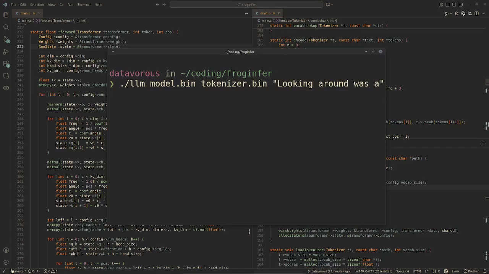

# froginfer

a micro inference runtime to run llama 2 models

**heavily** inspired by karpathy's [llama2.c](https://github.com/karpathy/llama2.c), but stripped down 
aggressively to the absolute barebones, such that even a middle schooler can understand what is going on.



## usage

download these files:

[tokenizer.bin](https://github.com/karpathy/llama2.c/raw/refs/heads/master/tokenizer.bin): helps the model turn numbers back into text

[model.bin](https://huggingface.co/karpathy/tinyllamas/resolve/main/stories15M.bin): llama 2 architecture model trained on tinystories dataset

git clone this repo, run `make` at root, and then:

```bash
./llm model.bin tokenizer.bin "it was raining "
```
## plans

1. use as a testing playground for [frogemm](https://github.com/datavorous/frogemm) and [frogtensor]().
2. swap components and test with my own implementations.
3. go top-down to understand the internals (i dont understand some parts of my code; they were derived from `llama2.c`)